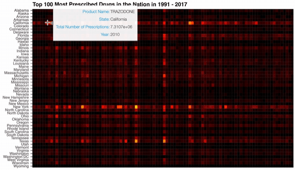
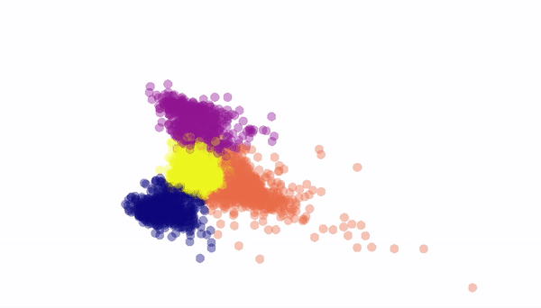

### Data Scientist 

I'm interested in analyzing data in a way that everyone can understand and helping organizations with machine learning and interactive data visualizations.

### Projects 

#### 1. Analyzing and Exploring 26 years of Medicaid Data

I wanted to find see what types of drugs people are on and why they are on them. To begin answering this question, I cleaned, explored, and visualized all of the available drug utilization data from Medicaid.gov. [Blog.](https://link.medium.com/V3GE3LpFeU) [Code.](https://github.com/DimaKav/Data_storytelling_project/blob/master/Exploring_All_Medicaid_Data.ipynb)

#### 2. k-means and PCA to Visualize Clusters in National Health Survey Data

Dimensionality reduction by PCA and k-means clustering to visualize patterns in data from diet, physical examinations, and hospital laboratory reports. [Blog](https://link.medium.com/01qzaM1CtU) [Code.](https://github.com/DimaKav/NHANES_project)

### Contact

- [LinkedIN](https://www.linkedin.com/in/dkavyazin/)
- [Twitter](https://twitter.com/d_kav)
- [GitHub](https://github.com/DimaKav?tab=repositories)
