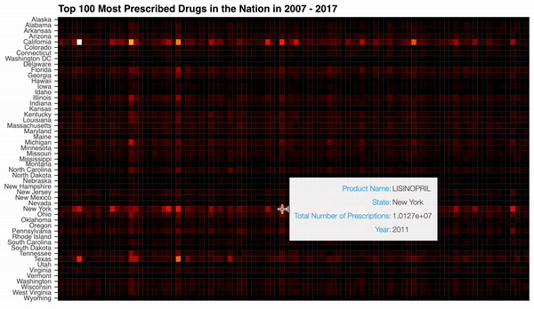

### Data Scientist

I'm interested in analyzing complex data in a way that everyone can understand and helping healthcare and medical organizations with machine learning and interactive data visualizations.

### Projects 

#### [1. Analyzing and Exploring 10 years of Medicaid Data](https://medium.com/@dmitriy.kavyazin/what-drugs-are-people-on-56ce31b40a4f) 

I wanted to find out what types of drugs people are on and why they are on them. To begin answering this question, I cleaned, explored, and visualized 10 years of Medicaid data. Surprising discovery: Florida has a low rate of prescriptions in comparsion to other highly populated states. [Code.](https://github.com/DimaKav/Data_storytelling_project/blob/master/DRUG_data.ipynb)

#### 2. An Analysis of Florida's Low Prescription Rates in People Enrolled in Medicaid

In my first projects, I discovered that Florida had a relatively low number of prescriptions for people in Medicaid. A natural question arose: why? To answer, I dug even deeper into Medicaid data and loaded all available data (27 years) into a dataframe to try to see trends with a higher sample size.

### Contact

- [Email](mailto:dkav@live.com)
- [LinkedIN](https://www.linkedin.com/in/dkavyazin/)
